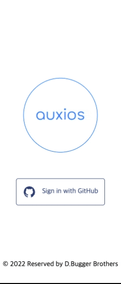
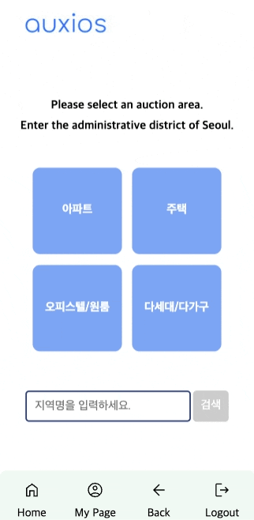
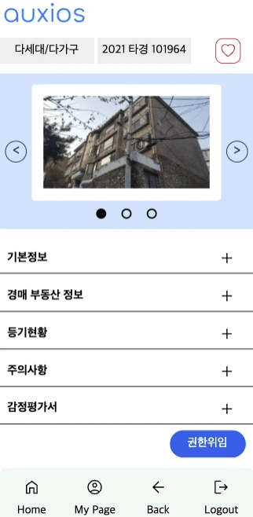
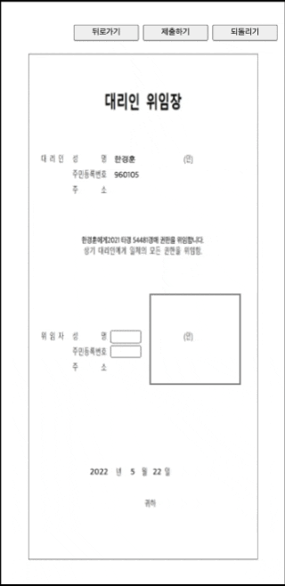
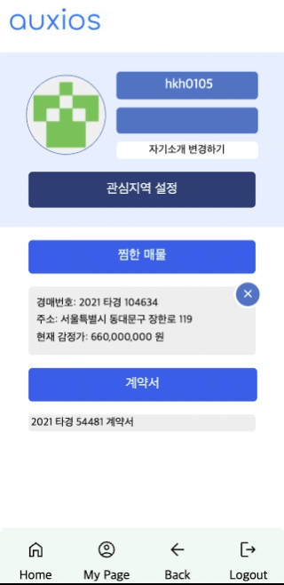

## 🗺 Auxios

서울 내의 법원경매 정보를 검색, 확인할 수 있는 웹뷰 기반 앱입니다.

<br>

## 📝 Requirements

`Auxios`는 안드로이드 360 x 750 해상도로 개발되었습니다. iOS 등 에서도 동작하지만 현재까지는 반응형 미디어쿼리가 처리되지 않아서 화면이 깨지는 현상이 발생합니다.

<br>

## ⚙️ Local Installation

### Client

```
git clone -b dev https://github.com/VanillaAuxious/Auxious-Front-netlify.git
npm install
npm start
```

### Server

```
git clone -b dev https://gitlab.com/th05662205/loca-chat-server
npm install
npm start
```

<br>

## ⚙️ Expo installation

### Client

```
git clone https://github.com/VanillaAuxious/Auxious-Front.git
npm install -g expo-cli
npm install
expo start
```

### Server

```
AWS EB에 배포되어 있기 때문에 별도의 작업이 필요하지 않습니다.
```

<br>

## 🗂 Features

<details>
<summary>1. 로그인 페이지</summary>
<div markdown="1">

- Github OAuth로 로그인합니다.


</div>
</details>

<details>
<summary>2. Navigation Bar</summary>
<div markdown="1">

- 하단 NavBar에 Home, Mypage, Back, Logout이 존재합니다.

</div>
</details>

<details>
<summary>3. 메인 페이지</summary>
<div markdown="1">

- 검색 필터가 설정이 가능합니다.
- 필터 아래 검색 인풋이 있고 검색 시 지도 페이지로 이동합니다.



</div>
</details>

<details>
<summary>4. 지도 페이지</summary>
<div markdown="1">

- 최상단에 다시 검색할 수 있는 검색창과 마커가 있습니다.
- 검색 필터에 해당하는 매물들을 지도 위에 마커 표시가 있습니다.
- 이 때 지도 중앙에서 지도 끝까지 내부 좌표에 있는 매물들만 서버에 요청하며, 나머지 매물들은 요청하지 않습니다.
- 마커 클릭시 해당 건물 정보로 이동합니다.
- 마커가 겹칠 경우 클러스터로 표시됩니다.
- 해당 지역에 있는 모든 매물을 바텀 시트로 표시됩니다.
- 일반매물 마커를 확인할 수 있는 버튼 포함합니다.
- 경매매물 마커를 클릭 시, 상세 페이지로 이동합니다.
- 일반매물 마커를 클릭 시, 일반매물 마커의 상세정보를 마커 위에 표시됩니다.
- 하단에는 현재 지도 내부의 모든 경매매물을 바텀 시트 형태로 보여줍니다.
- 매물이 많은 경우 바텀 시트 내부가 스크롤처리 됩니다.
- 바텀 시트에 있는 매물을 선택하면, 해당 매물의 상세페이지로 이동합니다.


</div>
</details>

<details>
<summary>5. 상세 페이지</summary>
<div markdown="1">

- 상단에 매물의 종류와 경매변호가 표시됩니다
- 경매번호 옆에는 관심건물로 등록할 수 있는 버튼이 있습니다.
- 경매번호 아래에는 사진이 슬라이드로 표시됩니다. 슬라이드는 좌우 터치, prev/next 버튼, slide dots을 통해서 움직일 수 있습니다.
- 상세 페이지 하단에는 기본 정보, 경매 부동산 정보, 등기 현황, 주의사항, 감정평가서가 아코디언 형태로 자리하고 있습니다.
- 해당 매물에 대해 경매 대리인을 임명할 수 있는 버튼이 있습니다.
- 권한위임 버튼을 누르면 어떤 대리인을 선택할 것인지 체크할 수 있는 모달이 출력됩니다. 대리인을 선택 시 경매 대리위임 계약서 페이지로 이동합니다.



</div>
</details>

<details>
<summary>6. 경매 대리위임 계약서 페이지</summary>
<div markdown="1">

- 계약서가 화면에 출력되고, 최상단에 돌아가기, 제출하기, 되돌리기 버튼이 있습니다.
- 계약서 상단에는 선택한 대리인에 대한 정보가 기본적으로 입력되어 있습니다.
- 하단에는 사용자의 이름, 주민등록번호, 서명을 기록할 수 있는 란이 있습니다.
- 서명 시, 서명란 바깥으로는 선이 그어지지 않습니다.
- 서명 완료 후 제출하기 버튼을 누르면 계약을 할 것인지 재확인 모달이 뜹니다.
- (로컬에서만 가능) 모달에서 '네'를 클릭하면, 계약서가 자동으로 다운로드 되고, 상세페이지로 이동합니다.
- (로컬에서만 가능) 마이페이지에서 지금까지 계약한 내역을 확인할 수 있고, 클릭시 계약서를 다시 확인할 수 있습니다.



</div>
</details>

<details>
<summary>7. 마이페이지</summary>
<div markdown="1">

- 상단에는 깃헙 프로필 이미지, ID, 자기소개를 포함한 프로필 란이 있습니다.
- 자기소개 아래에는 '자기소개 수정하기' 버튼이 있습니다.
- 자기소개 수정을 누를 시 수정 모달이 뜨며, 모달에 자기소개를 입력하면 자기소개를 변경할 수 있습니다.
- 프로필 란 아래에는 관심지역 페이지로 이동할 수 있는 버튼이 있습니다. 클릭 시 관심지역 페이지로 이동합니다.
- 관심지역 페이지 버튼 아래에는 관심건물 파트가 있습니다. 등록한 관심건물에 대한 간략한 정보가
  표시됩니다.
- 관심건물 정보를 클릭하면 해당 건물의 상세페이지로 이동합니다.
- 관심건물 정보 옆에는 X 버튼이 있어서 해당 건물을 관심건물에서 삭제할 수 있습니다.
- 관심건물 정보 아래에는 권환위임 계약서에 관련된 정보가 있습니다.
- (로컬에서만 가능) 계약서 정보를 클릭하면, 이전에 계약한 계약서를 다시 확인할 수 있습니다.



</div>
</details>

<details>
<summary>8. 관심지역 페이지</summary>
<div markdown="1">

- 관심지역에 관련된 설명이 상단에 표시됩니다.
- 관심지역 추가를 위해 검색할 수 있는 인풋 창이 표시됩니다.
- 인풋 창에 입력시 부분적으로, 혹은 전부 일치하는 서울의 동이 자동완성으로 표시됩니다.
- 해당 동을 클릭 시 관심지역으로 추가되며, 인풋 창 아래에 파란색 박스로 관심지역이 표시됩니다.
- 관심지역은 최대 3개만 등록할 수 있으며, 이미 등록한 지역 혹은 3개 이상 관심지역으로 등록하려고 시도하면 할 수 없다는 메세지가 출력됩니다.
- 불가능 메세지는 인풋창을 다시 포커스하면 사라집니다.
- 파란색 박스를 선택 시, 해당 지역이 관심지역에서 삭제됩니다.

</div>
</details>

<br>

## 🛠 Tech Stack

### Client

**1. React Native Webview: React로 만들어진 netlify uri를 연결하는 용도로 사용.**

**2. React : 실질적인 웹사이트 화면을 만드는데 사용된 기술**

2-1 대체 가능 기술 : React Native

<details>
<summary>React, React Native Webview 선정 이유</summary>
<div markdown="1">

- 처음 모바일 앱을 개발하기로 결정했을 때는 네이티브를 활용해서 개발할 지 고민했습니다. 그럼에도 웹뷰를 선택한 가장 큰 이유는 모바일 앱을 개발함과 동시에 기존에 부트캠프에서 배웠던 기술들을 더 갈고 닦을 수 있는 좋은 기회라고 생각했기 때문입니다.
- 웹뷰는 기본적으로 브라우저 환경에서 사용할 것을 상정한 HTML, CSS 등을 그대로 모바일 환경으로 옮기는 기술입니다. 그렇기 때문에 네이티브보다 기술과 성능적으로 제약이 많은 편이며, 저희가 원하는 화면을 원하는 성능으로 출력하기 위해서는 HTML, CSS, JS의 기능을 최대한 끌어내야만 했습니다. 이 점에서 웹뷰로 개발을 할 경우 팀원 전체의 웹 환경에 대한 전반적인 이해도 상승에 도움이 될 거라고 여겨서 웹뷰를 선택하게 되었습니다.
- 추가로, 처음 이 프로젝트를 시작할때는 배포까지 도전해보는 것을 염두에 두고 있었는데, 웹뷰는 네이티브 앱들에 비해서 심사과정을 덜 거치기 때문에 업데이트가 자유롭다는 점도 웹뷰를 선택하는 이유 중 하나였습니다.

</div>
</details>

**3. Redux Toolkit : 전역 상태 관리**

3-1) 대체 가능 기술 : Recoil, Zustand, Mobx 등등..

<details>
<summary>Redux Toolkit 선정 이유</summary>
<div markdown="1">

- Webview라는 챌린징한 기술을 사용하는 상황에서 상태관리 툴도 익숙하지 않은 것을 사용할 경우 일정을 맞추기 어려울 수도 있겠다는 생각 때문이었습니다.
- 프로젝트 이전 Recoil, Zustand, React Query 등 Redux의 기능들을 대체할 수 있는 기술 스택들을 조사해보았습니다. 그 중 Recoil이나 Zustand가 저희 프로젝트에 더 적합하다는데 모든 팀원들이 동의하였습니다. 하지만 Webview에 대해서 리서치를 진행하다보니 원래 생각헸던 것 보다 시간이 많이 소요될 것이라는 생각이 들었습니다. 그래서 일정을 맞추기 위해 팀원 세명 모두 익숙한 Redux를 기반으로 개발하기로 선택했습니다.

</div>
</details>

**4. SCSS : CSS 관리**

4-1) 대체 가능 기술 : Styled Component

<details>
<summary>SCSS 선택 이유</summary>
<div markdown="1">

- SCSS가 사용자 경험 측면에서 더 유리하다고 생각했기 때문입니다. Styled Component는 개발자가 사용하기 편리하고 처음 렌더링 시 가져오는 style 관련 정보량이 적습니다. 그 대신 CSS와 JS가 분리되어 있지 않기 때문에 매번 렌더링이 발생할 때마다 style도 같이 렌더링이 되어서 처음 렌더링 이후에는 속도가 느리며, JS script tag의 특성상 HTML이 전부 불러진 이후에 style 정보가 불러지기 때문에 화면에 css가 적용되는 속도가 느릴 수 있습니다.
- Auxios는 지도를 사용하고 화면 전환이 많은 앱이기 때문에 Styled Component를 사용할 경우 성능적으로 불리하다고 생각이 됐습니다. 그래서 처음 렌더링 시 정보량이 많은 것을 감안하더라도 CSS 전처리기를 사용하는 것이 좋다는 생각이 들어서 SCSS를 사용했습니다.

</div>
</details>

**5. Kakao Map API**

5-1) 대체 가능 기술 : Google Maps, Naver 지도

<details>
<summary>Kakao Map API 선택 이유</summary>
<div markdown="1">

- 가장 큰 이유 둘을 뽑자면 API 횟수제한과 [kakao devtalk](https://devtalk.kakao.com/)이 존재한다는 점이었습니다 Google maps의 경우 한국 관련된 지도 정보에 특화되지 않았다는 느낌이 있었고, Naver 지도의 경우 기능은 좋았지만 상대적으로 무겁고 개발자 커뮤니티 정보가 충분하지 않다는 느낌이 있었습니다. 무엇보다 1시간 동안 요청할 수 있는 API 횟수가 제한되어 있었는데, 저희 프로젝트는 API 요청 횟수가 필연적으로 많아지는 지라 사용에 무리가 있었습니다.
- 반면 카카오 맵의 경우 네이버보다 가볍고, 카카오 개발자들이 직접 API에 대한 질의응답을 해주는 커뮤니티가 활성화되어 있었기 때문에 문제에 직면했을 때 참고할 레퍼런스가 많다는 점이 매력적이었습니다. 실제로 개발 과정에서 현재 맵 뷰포트의 좌표 영역을 구하기, 화면에 마커 출력하기 등의 기능을 구현할 때 kakao devtalk의 질의응답 내역에서 힌트를 얻어서 빠르게 기능을 구현할 수 있었습니다. 또한 API 요청 횟수제한도 넉넉해서 API 문제때문에 앱이 정상적으로 동작하지 않는 경우에서도 자유로웠습니다.

</div>
</details>

**6. Expo**

<details>
<summary>Expo를 선택한 이유</summary>
<div markdown="1">

- 이 프로젝트에서 RN의 역할은 Webview를 통해 웹을 앱처럼 출력하는 정도에 그치기 때문에, 상대적으로 무거워도 사용이 편한 Expo를 사용했습니다. 또한 Expo의 빌드 기능을 사용하면 손쉽게 APK 파일을 만들 수 있다는 것도 매력적이었습니다.

</div>
</details>

<br/>

### Server

**1. Node.js / express.js**

<details>
<summary>Node/express 선택 이유</summary>
<div markdown="1">

- 저희 프로젝트의 경우 관심 지역/ 관심 건물 등록이나 지도 이동 시 마커 변환 등 단순한 데이터를 짧은 시간 동안 여러번 서버에 요청하는 경우가 많습니다. 그렇기 때문에 node.js의 가장 큰 장점인 IO 처리가 빠르다는 점이 저희 프로젝트와 잘 어울린다고 생각했습니다.

</div>
</details>

**2. MongoDB / Mongoose**

<details>
<summary>MongoDB & Mongoose 선택 이유</summary>
<div markdown="1">

- Auxios는 크롤링을 사용해서 새로운 데이터가 지속적으로 추가되는 것을 상정하고 만든 앱입니다. 그리고 데이터 간 연관성은 사용자의 관심지역, 관심건물 등록 등 1차원적으로 이루어져 있습니다. 그렇기 때문에 Relational한 데이터 구축에는 불리하지만 데이터 추가/삭제가 상대적으로 자유로운 NoSQL이 적합하다고 여겨서 몽고디비와 몽구스를 사용하기로 결정했습니다.
- 또한 카카오 맵을 로딩할 때 맵 중앙 좌표를 기점으로 맵의 뷰포트 범위 내의 좌표값을 가진 매물들을 불러오는 로직이 있습니다. 이 때 MongoDB에서 공식적으로 지원하는 GeoJSON을 사용하면 해당하는 매물들을 서칭하는 속도가 훨씬 빠르다는 점도 저희가 MongoDB를 선택한 중요한 이유 중 하나였습니다.

</div>
</details>

**3. Selenium**

<details>
<summary>Selenium 선택 이유</summary>
<div markdown="1">

- 처음에 selenium과 puppeteer 중 어떤 것을 선택할지 고민이었습니다. 속도와 성능 측면에서 puppeteer가 더 훌륭하지만, 일반적으로 크롤링은 nodejs가 아닌 언어에서 사용되는데 puppeteer는 자바스크립트와 크롬에만 한정된다는 단점이 있었습니다. 그래서 다른 언어와의 확장성이 더 좋고 다른 브라우저도 지원하는 selenium을 익히는 것이 크롤링을 익히는데 더 도움이 된다고 판단하여 선택했습니다.

</div>
</details>

<br>

## 🎉 Deployment

#### Client - [Netlify](https://teamproject-auxios.netlify.app/)

#### Server - AWS elastic beanstalk

<br>

## 🧗‍♀️ Challenges

1. Webview의 레퍼런스 부족
2. Wep API가 모바일에서는 미작동

<br>

## 🧨 Failures

1. Push Notification

- `firebase`의 `Cloud Messaging`를 이용하여 `Push Notification`의 기능 구현을 웹상으로는 구현을 완료하였는데, `Webview`를 적용시키니 알람이 가지않는 상황이 발생하였습니다.
- 해당 기능에 대해서는 조사를 진행 당시, 많은 레퍼런스가 `React native`에 쏠려 있었고 기술 구현 입장에 놓인 우리는 `React`로 구현하는 것에 대해 까다로운 점이 있었습니다. 심지어 최근 `firebase`가 import 방식부터 많은 부분을 업데이트(변경)하여, `firebase`를 적용하는 부분도 어려움에 있었습니다.
- 이를 통해 `레퍼런스를 응용하여 기능 구현하는 방법`과 제공 라이브러리 등 `버전 업데이트시, 변경 사항에 대해서 어느 부분을 체크해야 되는지 알아가는 스킬`을 가지게 되었습니다.

2. 계약서 다운로드와 앱 상에서 보여주기

- 해당 기능은 팀 프로젝트 진행 중 필요한 기능으로 판단되어 기능 구현 기간 막바지에 `추가 기능 요구사항`으로 기술검증을 진행하지 못한 채 시작하게 되었습니다.
- 기능을 구현하면서 `base 64 string`의 경우 크롬 창에서 직접적으로 Url로 여는 행위가 막혀있다는 것을 알게 되었고, 빈 창을 Window.open으로 열고, write로 iframe 태그를 넣는 식으로 조치를 하였습니다.
- 하지만 `webview 환경`에서 Window.open 메소드가 적용이 안 되었고 추가적인 문제가 발 생하였습니다.
- 또한, `jsPdf 라이브러리`의 save 메소드 또한 모바일 환경에서 적용이 안되는 것도 뒤늦게 알게 되었습니다.
- 이를 계기로 프로젝트 막바지에 추가 기능 요구사항을 진행하는 것이 위험하다는 것과 `적절한 기술검증`이 이루어지지 않는다면 기능구현 실패 확률이 올라간다는 것을 알게 되었습니다.

3. 자동으로 동작하는 크롤링 서버 구현

- 배포를 한 후 `스케줄 라이브러리`로 자동적으로 실행되게 코드를 작성하였는데, `headless 옵션`을 활성화 하지 않아, AWS 환경에서 실행이 되지 않았습니다.
- 미리 이러한 문제가 있을 수 있다는 것을 인지하지 못한 것이 크고, 그 외로 가끔 timeout이 걸리는 문제가 있어 성능적으로 최적화가 더 필요할 것 같습니다.

<br>

## 🧩 Issue & Things To Do

1. 일반매물 관련 크롤링

- [부동산 114](https://www.r114.com)라는 사이트에서 일반 부동산 매물 정보를 크롤링하는 것으로 구현 완료하였고 프로젝트 초기에는 정상적으로 동작하였습니다.
- 하지만 이후 추가 데이터 확보를 위해 다시 크롤링을 돌렸을 때 제대로 동작하지 않았습니다.
- 다시 웹사이트를 확인해보니 사이트의 일부 구조가 변경되어 있었고, `/robots.txt`로 크롤 가능여부를 확인해보니 기존에 'allowed'였던 것이 'disallowed'로 변경되어 있었습니다.
- 이 사실을 확인했을 때는 팀 프로젝트의 막바지였기 때문에, 새로운 사이트를 서칭하고 크롤링 로직을 다시 작성하는 것이 어려워 기존의 데이터만으로 프로젝트를 진행하게 되었습니다.
- 추가로 크롤링을 할 수 없어서 현재 `push notification`을 사용할 수 없습니다. (신규 데이터가 들어오는 순간을 잡을 수 없기 때문입니다.)
- 현재 기존 매물 데이터로만 구현이 가능합니다.

2. 현재 계약서 로직이 모바일에서는 동작하지 않습니다.

3. netlify에서는 경매 매물의 사진이 출력되지 않습니다. (모바일에서는 정상 출력됨)
